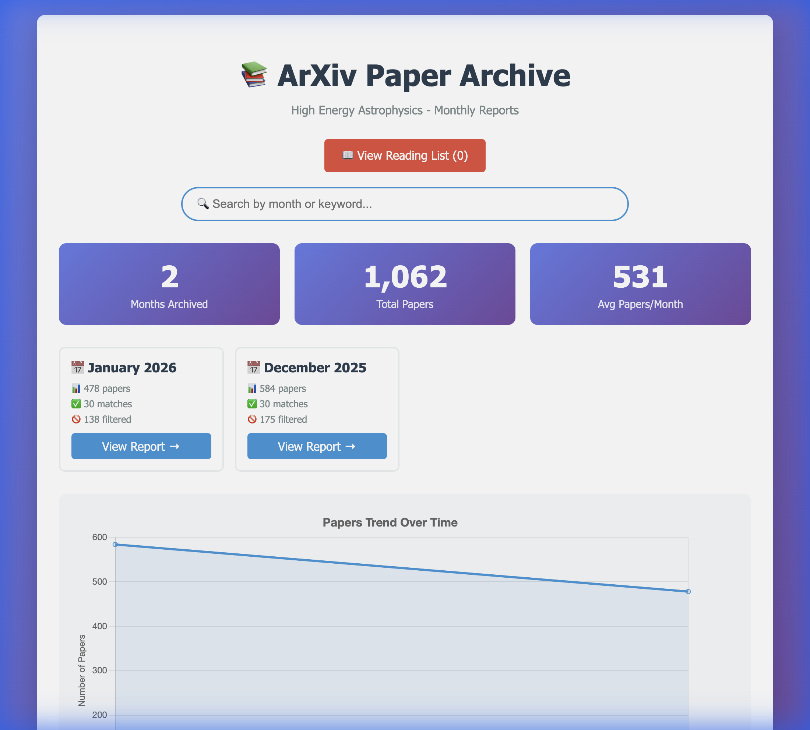

# 📚 ArXiv Paper Archive & Scorer

An intelligent arXiv paper recommendation system that uses **AI-powered hybrid scoring** (vector embeddings + LLM) to help researchers discover relevant papers in High Energy Astrophysics. The system builds a monthly archive with beautiful HTML reports and a personal reading list.



## 🎯 Project Overview

This tool solves the problem of information overload on arXiv by:

1. **Personalizing recommendations** based on your publication history (BibTeX file)
2. **Filtering out noise** using customizable keyword exclusions
3. **Hybrid AI scoring** combining fast vector similarity with deep LLM analysis
4. **Building a searchable archive** of monthly reports with trend visualization
5. **Managing a reading list** to track papers you want to read

### How It Works

```
Your Bibliography → AI Persona → Vector Embeddings → Top Candidates → LLM Re-scoring → Ranked Results
                                        ↓
                                Keyword Filtering
```

The system:
- Generates a research persona from your bibliography
- Filters papers by excluded keywords (e.g., "cosmology", "blazar")
- Uses vector embeddings for fast similarity matching
- Re-scores top candidates with LLM for nuanced relevance
- Generates beautiful HTML reports with interactive features

## ✨ Features

- **🤖 AI-Powered Scoring**: Hybrid approach using embeddings + LLM
- **📊 Monthly Archive System**: Organized reports with statistics and trends
- **🔍 Smart Filtering**: Exclude papers by keywords
- **📖 Reading List**: Browser-based personal collection
- **📈 Trend Visualization**: Track paper volume over time with Chart.js
- **🎨 Beautiful UI**: Modern, responsive HTML reports
- **⚡ Efficient**: Vector similarity pre-filters before expensive LLM calls

## 🛠️ Requirements

### Dependencies

```bash
pip install requests beautifulsoup4 numpy
```

Or using the provided requirements file:

```bash
pip install -r requirements.txt
```

### LLM Backend

This project requires a local LLM server (LMStudio) running:

1. **Download [LMStudio](https://lmstudio.ai/)**
2. **Load models**:
   - Chat model: `mistralai/ministral-3-3b` (or similar)
   - Embedding model: `nomic-embed-text-v1.5`
3. **Start the server** on `http://localhost:1234`

### Input Files

- **Bibliography**: `my-bibtex-Feb-2026.bib` - Your BibTeX file from ADS or similar
- **Ignored Keywords**: `ignored-keywords.txt` - One keyword per line to filter out

## 🚀 Usage

### Basic Usage

Process the current month:

```bash
python arxiv_scorer.py
```

### Process Specific Month

```bash
python arxiv_scorer.py --month 2025-12
```

### Example Workflow

```bash
# 1. Add keywords to filter (optional)
echo "blazar" >> ignored-keywords.txt

# 2. Process December 2025
python arxiv_scorer.py --month 2025-12

# 3. Open the archive
open reports/index.html
```

### Regenerate Pages

If you need to regenerate just the index or reading list:

```bash
# Regenerate index page
python regenerate_index.py

# Regenerate reading list page
python generate_reading_list.py
```

## 📁 Project Structure

```
arxiv-reader/
├── arxiv_scorer.py              # Main script
├── requirements.txt             # Python dependencies
├── my-bibtex-Feb-2026.bib       # Your bibliography
├── ignored-keywords.txt         # Keywords to filter
├── research_persona.txt         # Generated AI persona (cached)
├── regenerate_index.py          # Standalone index generator
├── generate_reading_list.py     # Standalone reading list generator
├── reports/                     # Generated HTML reports
│   ├── index.html              # Main archive page
│   ├── reading_list.html       # Your reading list
│   ├── 2026-01.html            # Monthly report
│   ├── 2025-12.html            # Monthly report
│   └── .archive_metadata.json  # Archive statistics
└── scraper.log                  # Processing logs
```

## 📊 Output

### Monthly Reports

Each month generates:
- **HTML report** with top 30 papers ranked by relevance
- **Scores** showing vector similarity and LLM assessment
- **Interactive features**: Add to reading list, filter by keywords
- **Statistics**: Total papers, filtered count, top matches

### Archive Index

The main `reports/index.html` provides:
- **Statistics dashboard**: Total months, papers, averages
- **Month grid**: 4-column responsive layout
- **Trend chart**: Visualize paper volume over time
- **Search functionality**: Filter months by keyword
- **Reading list access**: Quick link to saved papers

### Reading List

Browser-based personal collection using localStorage:
- **Persistent storage**: Papers saved across sessions
- **Sortable**: By date added
- **Manageable**: Remove individual papers or clear all

## ⚙️ Configuration

Edit the constants in `arxiv_scorer.py`:

```python
LMSTUDIO_BASE_URL = "http://localhost:1234/v1"
CHAT_MODEL = "mistralai/ministral-3-3b"
EMBEDDING_MODEL = "text-embedding-nomic-embed-text-v1.5"
BIBLIOGRAPHY_FILE = "my-bibtex-Feb-2026.bib"
IGNORED_KEYWORDS_FILE = "ignored-keywords.txt"
TOP_K_CANDIDATES = 30  # Number of papers to re-score with LLM
```

## 🎨 Customization

### Ignored Keywords

Add keywords to `ignored-keywords.txt` (one per line):

```
cosmology
black hole
GRB
dark matter
blazar
```

Papers with these keywords in the title will be filtered out before scoring.

### ArXiv Category

Currently set to `astro-ph.HE` (High Energy Astrophysics). Modify line 1184 in `arxiv_scorer.py`:

```python
arxiv_url = f"https://arxiv.org/list/astro-ph.HE/{month_year}?skip=0&show=2000"
```

## 📝 Example Output

```
====== FINAL RESULTS ======

1. [Score: 86.2] High-Resolution Measurements with the CTAO Southern Array
    Link: https://arxiv.org/abs/2512.17498
    (Vector: 0.74, LLM: 98)
----------------------------------------
2. [Score: 81.0] Revisiting the Supernova Engines in 3C 397
    Link: https://arxiv.org/abs/2512.01176
    (Vector: 0.77, LLM: 85)
----------------------------------------
...
```

## 🤝 Contributing

This is a personal research tool, but feel free to fork and adapt for your own field!

## 📄 License

MIT License - feel free to use and modify for your research needs.

## 🙏 Acknowledgments

- **LMStudio** for local LLM inference
- **arXiv** for open access to research papers
- **Chart.js** for beautiful visualizations

---

**Note**: This tool is designed for High Energy Astrophysics but can be adapted for any arXiv category by modifying the URL and updating the ignored keywords list.
